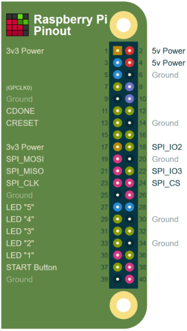

Install wiringpi to get the `gpio` command:

```
apt install wiringpi
```

There are five LEDs on the front.  The indicate which subsystems work.

1. An error occurred
2. Test Error
3. Test Error
4. Test Error
5. Tester is IDLE (also, tester is READY)

LEDs 2, 3, and 4 form a pattern that indicate which test failed:

| Test name            | 2 (Green) | 3 (Blue)  | 4 (White) | Reason for Failure |
| -------------------- | --------- | --------- | --------- | ------------------ |
| SPI Valid            |           |     x     |     x     | The SPI flash was not found, or was not the correct model |
| USB Communication    |     x     |           |           | The FPGA isn't assembled correctly, the USB pullup isn't correct, or the crystal is bad |
| Load Test Bitstream  |           |           |           | The FPGA isn't assembled correctly |
| Test SPI             |           |     x     |           | Not all four wires are connected between the FPGA and the SPI |
| Test RGB             |     x     |     x     |           | TOUCH2 or the RGB LED are not assembled correctly |
| Test Touch           |           |     x     |     x     | TOUCH1, TOUCH3, or TOUCH4 are not assembled correctly |
| Final Bitstream      |           |           |     x     | The final program could not be loaded |

## Connecting the Jig

Use the following wiring diagram to attach the jig to the Raspberry Pi:

